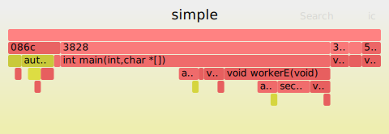
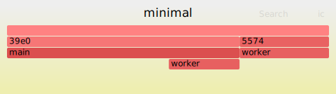

# glimmer 🔥
A tiny cpp23 flame graph profiling library




## Motivation
- hot profiling, directly in code
- decide where and what you measure
- flamegraphs for regression testing as automated CI artifacts
- personal exploration of the new `std::stacktrace` and other cpp23 features

## Overview
- `Frame` - collection of scopes over time
- `Scope` - location and time of entry and exit
- `Guard` - lifetime-based scope


## Output
Dump textfile in stack collapse format.
Can be used directly with [FlameGraph](https://github.com/brendangregg/FlameGraph) or [speedscope](https://www.speedscope.app/).
Shoutout [Brendan Gregg](https://twitter.com/brendangregg) and [Jamie Wong](https://twitter.com/jlfwong) for building and sharing kool stuff.


## Usage
```cpp
#include <glimmer/glimmer.h>
#include <future>

void worker() {
    GLIMMER_GUARD;
    std::this_thread::sleep_for( std::chrono::milliseconds( 10 ) );
}

int main( int argc, char* argv[] ) 
{
    GLIMMER_BEGIN;

    worker();
    std::async( worker ).wait();

    GLIMMER_END;
    GLIMMER_DUMP;
}
```

```
flamegraph.pl --title simple \
    --colors java \
    --inverted \
    --width 480 \
    --nametype "" \ 
    --countname ms \
    --hash minimal.txt > minimal.svg
``` 




## Options
- ` GLIMMER_DISABLE` - Allows for zero-overhead production builds
- ` GLIMMER_INCLUDE_FUNCTION_OFFSET` - Add function offset suffix, e.g. `main+0x43`
- ` GLIMMER_INCLUDE_SYSTEM_CALLS` - Include system calls
    - Windows: `MSVCP|ntdll|KERNEL32`
    - Unix: `libc|libpthread|libstdc++|libm|libdl|libgcc`
- ` GLIMMER_INCLUDE_LIBRARY_ENTRIES` - Include c/cpp standard library calls
    - Windows: `Microsoft Visual Studio|vctools`
    - Unix: /lib/|/usr/lib/|/opt/|/System/Library/`
- ` GLIMMER_BUILD_EXAMPLES`