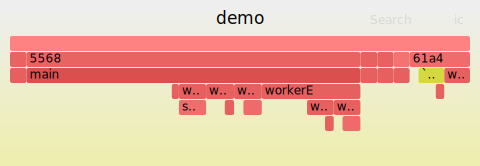

# glimmer 🔥
A tiny cpp23 flame graph profiling library




## Motivation
- hot profiling, directly in code
- decide where and what you measure
- flamegraphs for regression testing via automated CI artifacts
- case study of `std::stacktrace` and other modern cpp23 features


## Overview
- `Frame` - collection of scopes over time
- `Scope` - location and time of entry and exit
- `Guard` - lifetime-based scope

**glimmer 🔥** is thread-safe, i.e. `Frame::push`, `pop`, `close` and in extension `Guard` can be used safely from anywhere, anytime.


## Output
Folded stack collapse as `.txt` (LF) file.
Can be used directly with [FlameGraph](https://github.com/brendangregg/FlameGraph) or [speedscope](https://www.speedscope.app/).
Shoutout [Brendan Gregg](https://twitter.com/brendangregg) and [Jamie Wong](https://twitter.com/jlfwong) for building and sharing kool stuff.


## Usage

### Profile
```cpp
#include <glimmer/glimmer.h>
#include <future>

void worker() {
    GLIMMER_GUARD;  //  automatic capture of function entry and exit
    std::this_thread::sleep_for( std::chrono::milliseconds( 10 ) );
}

int main( int argc, char* argv[] ) 
{
    GLIMMER_BEGIN;  //  manual scope

    worker();       //  sync call
    std::async( worker ).wait();    //  async call   
                    
    GLIMMER_END;    //  automatic close of latest active
    GLIMMER_DUMP;   //  write folded stack collapse to disk
}
```

```
# collapsed.txt
0aa4;main 39230
0aa4;main;worker 23121
2870;worker 15857
```

### Visualize
View directly on [https://speedscope.com](https://speedscope.com), or convert using Brendan's FlameGraph.
```
flamegraph.pl --title minimal --colors java --inverted --width 480 --nametype "" --countname us --hash minimal.txt > minimal.svg
``` 


## Options
- ` GLIMMER_DISABLE` - Allows for zero-overhead production builds
- ` GLIMMER_INCLUDE_FUNCTION_OFFSET` - Add function offset suffix, e.g. `main+0x43`
- ` GLIMMER_INCLUDE_SYSTEM_CALLS` - Include system calls
    - Windows: `MSVCP|ntdll|KERNEL32`
    - Unix: `libc|libpthread|libstdc++|libm|libdl|libgcc`
- ` GLIMMER_INCLUDE_LIBRARY_ENTRIES` - Include c/cpp standard library calls
    - Windows: `Microsoft Visual Studio|vctools`
    - Unix: /lib/|/usr/lib/|/opt/|/System/Library/`
- ` GLIMMER_BUILD_EXAMPLES`


## Defines
Convenience functions for quick access to a global frame instance.

- `GLIMMER` - global frame instance
- `GLIMMER_BEGIN` - generic scope; make sure to close it again
- `GLIMMER_END` - close latest active scope; make sure to match with begin
- `GLIMMER_GUARD` - generic guard; only one per cpp scope
- `GLIMMER_DUMP` - write global frame to _YYYY-mm-dd_hhMMSS\_collapsed.txt_
- `GLIMMER_NBEGIN` - named scope; can be used to identify scopes inside single function
- `GLIMMER_NGUARD` - named guard; can be used to provide more a readible name for guarded scope
- `GLIMMER_NDUMP` - named dump; write global frame to custom filename
    

## Backlog
- left heavy and sandwich reductions
- imgui component