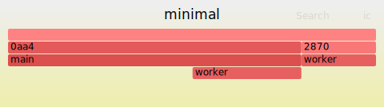

# glimmer 🔥
A tiny cpp flame graph profiling library


## Overview
- `Frame` - collection of scopes over time
- `Scope` - location and time of entry and exit
- `Guard` - lifetime-based scope


## Output
Dump textfile in stack collapse format.
Can be used directly with [FlameGraph](https://github.com/brendangregg/FlameGraph) or [speedscope](https://www.speedscope.app/).
Shoutout [Brendan Gregg](https://twitter.com/brendangregg) and [Jamie Wong](https://twitter.com/jlfwong) for building and sharing kool stuff.


## Usage
```cpp
#include <glimmer/glimmer.h>
#include <future>

void worker() {
    GLIMMER_GUARD;
    std::this_thread::sleep_for( std::chrono::milliseconds( 10 ) );
}

int main( int argc, char* argv[] ) 
{
    GLIMMER_BEGIN;

    worker();
    std::async( worker ).wait();

    GLIMMER_END;
    GLIMMER_DUMP;
}
```

```
# minimal.txt
1d28;main(int,char *[]) 32999
1d28;main(int,char *[]);worker(void) 16912
2364;worker(void) 15916
```

```
flamegraph.pl --title simple \
    --colors java \
    --inverted \
    --width 480 \
    --nametype "" \ 
    --countname ms \
    --hash minimal.txt > minimal.svg
``` 




## Options

### GLIMMER_INCLUDE_X

```
GLIMMER_INCLUDE_RETURN_TYPE
|                              GLIMMER_INCLUDE_SIGNATURE
|                              |          GLIMMER_INCLUDE_SUFFIXES
[float] __cdecl [Object::exec] [(float&)] [const override]          

//  Object::exec
//  float Object::exec
//  float Object::exec(float&)
//  float Object::exec(float&) const override

//  DEFAULT
//  Object::exec(float&)
```

### GLIMMER_PREPEND_FUNCTION_TO_NAMED

```
float compute(void) {
    GLIMMER_NGUARD( "ScopeWithCustomName" );
}

//  OFF
glimmer;main;ScopeWithCustomName 1000

//  ON
glimmer;main;float compute(void)::ScopeWithCustomName 1000
```