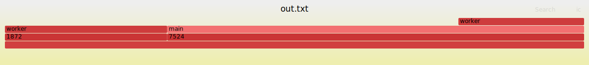

# glimmer 🔥
A tiny cpp flame graph profiling library


## Overview
- `Frame` - keep track of beginning and ending scopes 
- `Scope` - location and times of entry and exit
- `Guard` - lifetime-based scope


## Output
Dump textfile in stack collapse format.
Can be used directly with [FlameGraph](https://github.com/brendangregg/FlameGraph) or [speedscope](https://www.speedscope.app/).
Shoutout [Brendan Gregg](https://twitter.com/brendangregg) and [Jamie Wong](https://twitter.com/jlfwong) for building and sharing kool stuff.


## Usage
```cpp
#include <glimmer/glimmer.h>
#include <future>

void worker() {
    GLIMMER_GUARD;
    std::this_thread::sleep_for( std::chrono::milliseconds( 10 ) );
}

int main( int argc, char* argv[] ) 
{
    GLIMMER_BEGIN;

    worker();
    std::async( worker ).wait();

    GLIMMER_END;
    glimmer::dump( GLIMMER, "out.txt" );
}
```

``` 
# out.txt
7524;main 28179
7524;main;worker 12166
1872;worker 15706
```




## Naming

### MSVC
- `void __cdecl worker(void)`
- `float __cdecl Object::exec(void)`
- `__cdecl Object::~Object(void)`
- `auto __cdecl main::<lambda_2>::operator ()(const float,const int &) const`
- `double __cdecl Object::compute(const float,const int &) override`

### Name Only
- `worker`
- `Object::exec`
- `Object::~Object`
- `main::<lambda_2>`
- `Object::compute` 

### GLIMMER_INCLUDE_ALL
- `void worker(void)`
- `float Object::exec(void)`
- `Object::~Object(void)`
- `auto main::<lambda_2>(const float,const int &) const`
- `double Object::compute(const float,const int &) override` 